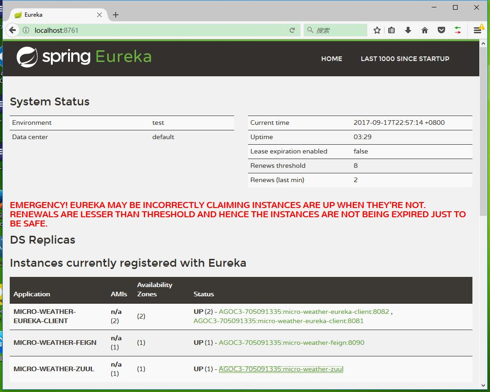

# 实现 API 网关

## 一个最简单的 Zuul 应用

主应用：

```java
@SpringBootApplication
@EnableDiscoveryClient
@EnableZuulProxy
public class Application {

    public static void main(String[] args) {
        SpringApplication.run(Application.class, args);
    }

}
```

其中：`@EnableZuulProxy`启用了 Zuul 作为反向代理服务器。

项目配置：

```
spring.application.name: micro-weather-zuul

eureka.client.serviceUrl.defaultZone: http://localhost:8761/eureka/

zuul.routes.users.path: /hi/**
zuul.routes.users.serviceId: micro-weather-eureka-client
```

其中：

* zuul.routes.users.path ： 为要拦截请求的路径；
* zuul.routes.users.serviceId：为要拦截请求的路径所要映射的服务。本例，我们将所有`/hi`下的请求，都转发到 `micro-weather-eureka-client` 服务中去。

## 如何测试

启动在之前章节中搭建的 `micro-weather-eureka-server` 和 `micro-weather-eureka-client`  两个项目，以及本例的 `micro-weather-zuul` 。 


如果一切正常，在之前章节中搭建的 `micro-weather-eureka-server` 管理界面，能看到上述服务的信息。




在浏览器访问 `micro-weather-zuul`服务（本例，地址为<http：//locahost:8080>），当我们试图访问<http：//locahost:8080/hi/hello>接口时，只需要访问如果一切正常，可以在控制台看到“Hello world”字样，这个就是转发请求到`micro-weather-eureka-client` 服务时响应的内容。 


## 源码

本章节源码，见`micro-weather-zuul` 。