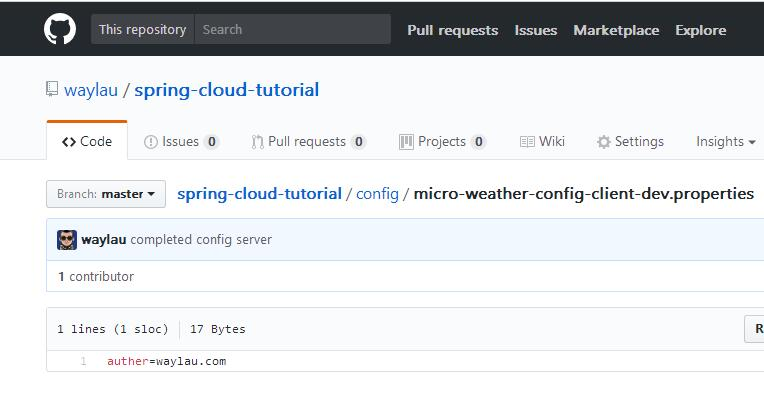
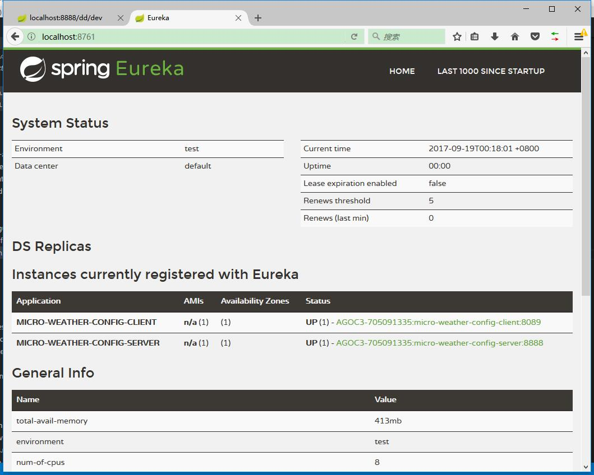

# 实现微服务的集中化配置

创建一个`micro-weather-config-client` 作为配置服务器的客户端。

## 开发环境

* Gradle 4.0
* Spring Boot 2.0.0.M3
* Spring Cloud Netflix Eureka Client Finchley.M2
* Spring Cloud Config Client Finchley.M2

## 更改配置

增加如下配置：

```groovy
dependencies {
    //...

	compile('org.springframework.cloud:spring-cloud-starter-netflix-eureka-client')
	compile('org.springframework.cloud:spring-cloud-starter-config')

	//...
}
```

项目配置：

```
spring.application.name: micro-weather-config-client
server.port=8089

eureka.client.serviceUrl.defaultZone: http://localhost:8761/eureka/

spring.cloud.config.profile=dev
spring.cloud.config.uri= http://localhost:8888/
```

其中:

* spring.cloud.config.uri ： 指向了配置服务器`micro-weather-config-server`的位置。

## 一个最简单的 Config Client

主应用：

```java
@SpringBootApplication
@EnableDiscoveryClient
public class Application {

    public static void main(String[] args) {
        SpringApplication.run(Application.class, args);
    }

}
```

## 如何测试


在<https://github.com/waylau/spring-cloud-tutorial/tree/master/config> 我们放置了一个配置文件`micro-weather-config-client-dev.properties`，里面简单的放置了测试内容:

```
auther=waylau.com
```




编写测试用例：

```java
@RunWith(SpringRunner.class)
@SpringBootTest
public class ApplicationTests {

	@Value("${auther}")
    private String auther;
	
	@Test
	public void contextLoads() {
		System.out.println(auther);
	}

}
```

启动在之前章节中搭建的 `micro-weather-eureka-server` 和 `micro-weather-config-server`  两个项目。


启动测试用例，如果一切正常，可以在控制台看到“waylau.com”字样，说明，我们拿到了`auther`在配置服务器中的内容。 

如果同时也启动了 `micro-weather-config-client` 项目，则能在 
启动在之前章节中搭建的 `micro-weather-eureka-server` 管理界面，看到这个服务的信息。



## 源码

本章节源码，见`micro-weather-config-client` 。