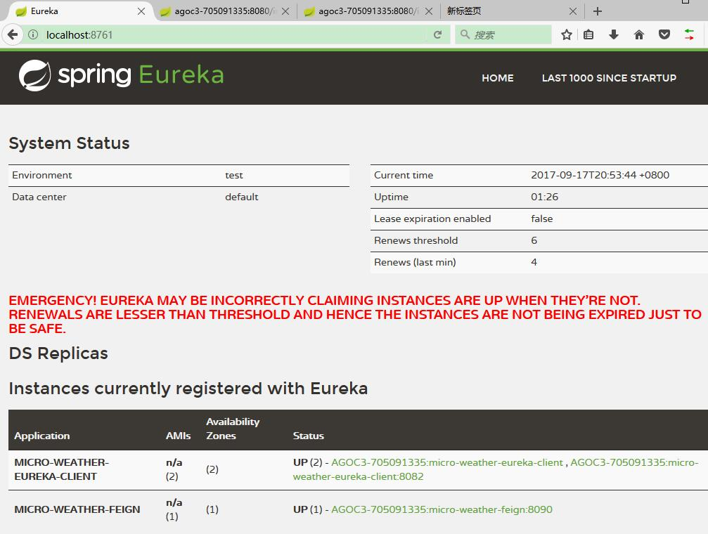

# 实现服务的消费者

本章节，我们将创建一个`micro-weather-feign` 作为服务器的消费者，并演示如何使用 Feign 来消费服务。

在 `micro-weather-eureka-client`  的基础上稍作修改即可

## 开发环境

* Gradle 4.0
* Spring Boot 2.0.0.M3
* Spring Cloud Netflix Eureka Client Finchley.M2
* Spring Cloud Starter OpenFeig Finchley.M2

## 更改配置

增加如下配置：

```groovy
dependencies {
    //...

	compile('org.springframework.cloud:spring-cloud-starter-openfeign')

	//...
}
```

## 声明式 REST 客户端——Feign

Feign 是一个声明式的 Web 服务客户端。这使得Web服务客户端的写入更加方便。它具有可插拔注释支持，包括Feign注释和JAX-RS注释。Feign还支持可插拔编码器和解码器。Spring Cloud增加了对Spring MVC注释的支持，并且使用了在Spring Web中默认使用的相同的HttpMessageConverter。 在使用Feign时，Spring Cloud集成了Ribbon和Eureka来提供负载平衡的http客户端。

## 一个最简单的 Feign

主应用：

```java
@SpringBootApplication
@EnableDiscoveryClient
@EnableFeignClients
public class Application {

    public static void main(String[] args) {
        SpringApplication.run(Application.class, args);
    }

}
```

编写 Feign 请求接口：

```java
package com.waylau.spring.cloud.service;

import org.springframework.cloud.netflix.feign.FeignClient;
import org.springframework.web.bind.annotation.RequestMapping;
import org.springframework.web.bind.annotation.RequestMethod;

/**
 * Hello Client
 * 
 * @since 1.0.0 2017年9月17日
 * @author <a href="https://waylau.com">Way Lau</a> 
 */
@FeignClient("micro-weather-eureka-client")
public interface HelloClient {
	@RequestMapping(method = RequestMethod.GET, value = "/hello")
    String getHello();
}
```

其中：`@FeignClient`指定了要访问的服务的名称“micro-weather-eureka-client”。

项目配置：

```
spring.application.name: micro-weather-feign

eureka.client.serviceUrl.defaultZone: http://localhost:8761/eureka/

feign.client.config.feignName.connectTimeout: 5000
feign.client.config.feignName.readTimeout: 5000
```


## 如何测试

编写测试用例：

```java
@RunWith(SpringRunner.class)
@SpringBootTest
public class HelloClientTest {

	@Autowired
	private HelloClient helloClient;
	
	@Test
	public void testHello() {
		String hello = helloClient.getHello();
		System.out.println(hello);
	}

}
```

启动在之前章节中搭建的 `micro-weather-eureka-server` 和 `micro-weather-eureka-client`  两个项目。这样， `micro-weather-eureka-client`服务，就能被 `micro-weather-feign`  发现，并进行访问。


启动测试用例，如果一切正常，可以在控制台看到“Hello world”字样。这个就是请求`micro-weather-eureka-client` 服务时响应的内容。 

如果同时也启动了 `micro-weather-feign` 项目，则能在 
启动在之前章节中搭建的 `micro-weather-eureka-server` 管理界面，看到这个服务的信息。



## 源码

本章节源码，见`micro-weather-feign` 。