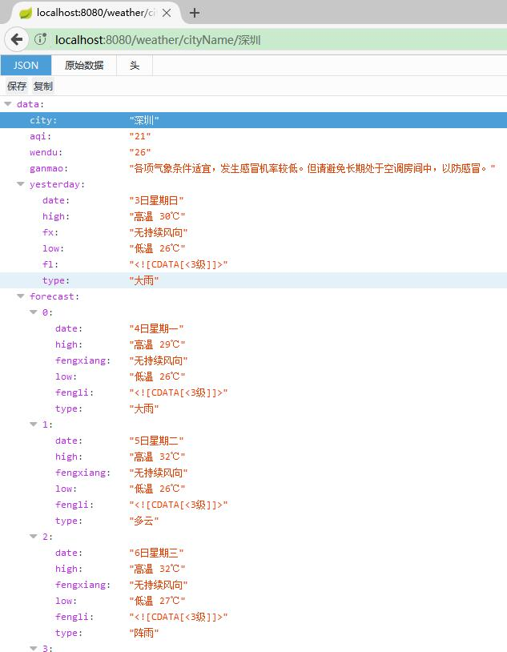

# 第一个微服务实现——天气预报服务


本章节，我们将基于 Spring Boot 技术来实现我们的第一个微服务天气预报应用——micro-weather-basic。micro-weather-basic 的作用是实现简单的天气预报功能，可以根据不同的城市，查询该城市的实时天气情况。

## 开发环境

* Gradle 4.0
* Spring Boot 1.5.6
* Apache HttpClient 1.5.3

## 数据来源

理论上，天气的数据是天气预报的实现基础。本应用与实际的天气数据无关，理论上，可以兼容多种数据来源。但为求简单，我们在网上找了一个免费、可用的天气数据接口。

* 天气数据来源为中华万年历。例如：
	* 通过城市名字获得天气数据 ：<http://wthrcdn.etouch.cn/weather_mini?city=深圳>
	* 通过城市id获得天气数据：<http://wthrcdn.etouch.cn/weather_mini?citykey=101280601>
* 城市ID列表。每个城市都有一个唯一的ID作为标识。见 <http://cj.weather.com.cn/support/Detail.aspx?id=51837fba1b35fe0f8411b6df> 或者 <http://mobile.weather.com.cn/js/citylist.xml>。

调用天气服务接口示例，我们以“深圳”城市为例，可用看到如下天气数据返回。

```json
{
    "data": {
        "yesterday": {
            "date": "1日星期五",
            "high": "高温 33℃",
            "fx": "无持续风向",
            "low": "低温 26℃",
            "fl": "<![CDATA[<3级]]>",
            "type": "多云"
        },
        "city": "深圳",
        "aqi": "72",
        "forecast": [
            {
                "date": "2日星期六",
                "high": "高温 32℃",
                "fengli": "<![CDATA[<3级]]>",
                "low": "低温 26℃",
                "fengxiang": "无持续风向",
                "type": "阵雨"
            },
            {
                "date": "3日星期天",
                "high": "高温 29℃",
                "fengli": "<![CDATA[5-6级]]>",
                "low": "低温 26℃",
                "fengxiang": "无持续风向",
                "type": "大雨"
            },
            {
                "date": "4日星期一",
                "high": "高温 29℃",
                "fengli": "<![CDATA[3-4级]]>",
                "low": "低温 26℃",
                "fengxiang": "西南风",
                "type": "暴雨"
            },
            {
                "date": "5日星期二",
                "high": "高温 31℃",
                "fengli": "<![CDATA[<3级]]>",
                "low": "低温 27℃",
                "fengxiang": "无持续风向",
                "type": "阵雨"
            },
            {
                "date": "6日星期三",
                "high": "高温 32℃",
                "fengli": "<![CDATA[<3级]]>",
                "low": "低温 27℃",
                "fengxiang": "无持续风向",
                "type": "阵雨"
            }
        ],
        "ganmao": "风较大，阴冷潮湿，较易发生感冒，体质较弱的朋友请注意适当防护。",
        "wendu": "29"
    },
    "status": 1000,
    "desc": "OK"
}
```

我们通过观察数据，来了解每个返回字段的含义。

* "city": 城市名称
* "aqi": 空气指数,
* "wendu": 实时温度
* "date": 日期，包含未来5天
* "high":最高温度
* "low": 最低温度
* "fengli": 风力
* "fengxiang": 风向
* "type": 天气类型

以上数据，是我们需要的天气数据的核心数据，但是，同时也要关注下面两个字段：

* "status": 接口调用的返回状态，返回值“1000”,意味着数据是接口正常
* "desc": 接口状态的描述，“OK”代表接口正常

重点关注返回值不是“1000”的情况,说明，这个接口调用异常了。

## 初始化一个 Spring Boot 项目

初始化一个 Spring Boot 项目 `micro-weather-basic`，该项目可以直接在我们之前章节课程中的 basic-gradle 项目基础进行修改。同时，为了优化项目的构建速度，我们对Maven中央仓库地址和 Gradle Wrapper 地址做了调整。其中细节暂且不表，读者可以自行参阅源码，或者学习笔者所著的《Spring Boot 教程》（<https://github.com/waylau/spring-boot-tutorial>）。其原理，我也整理到我的博客中了：

* https://waylau.com/change-gradle-wrapper-distribution-url-to-local-file/
* https://waylau.com/use-maven-mirrors/


## 项目配置

添加 Apache HttpClient 的依赖，来作为我们Web请求的客户端。

```groovy
// 依赖关系
dependencies {
	//...
 
	// 添加  Apache HttpClient 依赖
	compile('org.apache.httpcomponents:httpclient:4.5.3')

 	//...
}
```
## 创建天气信息相关的值对象


创建`com.waylau.spring.cloud.vo`包，用于相关值对象。创建天气信息类 Weather


```java
public class Weather implements Serializable {
	 
	private static final long serialVersionUID = 1L;
		
	private String city;
    private String aqi;
    private String wendu;
    private String ganmao;
	private Yesterday yesterday;
    private List<Forecast> forecast;
 
	public String getCity() {
		return city;
	}
	public void setCity(String city) {
		this.city = city;
	}
	public String getAqi() {
		return aqi;
	}
	public void setAqi(String aqi) {
		this.aqi = aqi;
	}
	public String getWendu() {
		return wendu;
	}
	public void setWendu(String wendu) {
		this.wendu = wendu;
	}
	public String getGanmao() {
		return ganmao;
	}
	public void setGanmao(String ganmao) {
		this.ganmao = ganmao;
	}
    public Yesterday getYesterday() {
		return yesterday;
	}
	public void setYesterday(Yesterday yesterday) {
		this.yesterday = yesterday;
	}
	public List<Forecast> getForecast() {
		return forecast;
	}
	public void setForecast(List<Forecast> forecast) {
		this.forecast = forecast;
	}
}
```

昨日天气信息：

```java
public class Yesterday implements Serializable {
 
	private static final long serialVersionUID = 1L;
	
	private String date;
    private String high;
    private String fx;
    private String low;
    private String fl;
    private String type;

	public Yesterday() {

	}
	
    public String getDate() {
		return date;
	}

	public void setDate(String date) {
		this.date = date;
	}

	public String getHigh() {
		return high;
	}

	public void setHigh(String high) {
		this.high = high;
	}

	public String getFx() {
		return fx;
	}

	public void setFx(String fx) {
		this.fx = fx;
	}

	public String getLow() {
		return low;
	}

	public void setLow(String low) {
		this.low = low;
	}

	public String getFl() {
		return fl;
	}

	public void setFl(String fl) {
		this.fl = fl;
	}

	public String getType() {
		return type;
	}

	public void setType(String type) {
		this.type = type;
	}

}
```


未来天气信息：

```java
public class Forecast implements Serializable {
	
	private static final long serialVersionUID = 1L;
	
	private String date;
    private String high;
    private String fengxiang;
    private String low;
    private String fengli;
    private String type;

	public String getDate() {
		return date;
	}

	public void setDate(String date) {
		this.date = date;
	}

	public String getHigh() {
		return high;
	}

	public void setHigh(String high) {
		this.high = high;
	}

	public String getFengxiang() {
		return fengxiang;
	}

	public void setFengxiang(String fengxiang) {
		this.fengxiang = fengxiang;
	}

	public String getLow() {
		return low;
	}

	public void setLow(String low) {
		this.low = low;
	}

	public String getFengli() {
		return fengli;
	}

	public void setFengli(String fengli) {
		this.fengli = fengli;
	}

	public String getType() {
		return type;
	}

	public void setType(String type) {
		this.type = type;
	}

	public Forecast() {

	}
 
}
```

WeatherResponse 作为整个消息的返回对象

```java
public class WeatherResponse implements Serializable {

	private static final long serialVersionUID = 1L;

	private Weather data; // 消息数据
	private String status; // 消息状态
	private String desc; // 消息描述

	public Weather getData() {
		return data;
	}

	public void setData(Weather data) {
		this.data = data;
	}

	public String getStatus() {
		return status;
	}

	public void setStatus(String status) {
		this.status = status;
	}

	public String getDesc() {
		return desc;
	}

	public void setDesc(String desc) {
		this.desc = desc;
	}

}

```

## 服务接口及实现

定义了获取服务的两个接口方法

```java
public interface WeatherDataService {

	/**
	 * 根据城市ID查询天气数据
	 * @param cityId
	 * @return
	 */
	WeatherResponse getDataByCityId(String cityId);
	
	/**
	 * 根据城市名称查询天气数据
	 * @param cityId
	 * @return
	 */
	WeatherResponse getDataByCityName(String cityName);
}
```

其实现为:

```java
@Service
public class WeatherDataServiceImpl implements WeatherDataService {

	@Autowired
	private RestTemplate restTemplate;

	private final String WEATHER_API = "http://wthrcdn.etouch.cn/weather_mini";

	@Override
	public WeatherResponse getDataByCityId(String cityId) {
		String uri = WEATHER_API + "?citykey=" + cityId;
		return this.doGetWeatherData(uri);
	}

	@Override
	public WeatherResponse getDataByCityName(String cityName) {
		String uri = WEATHER_API + "?city=" + cityName;
		return this.doGetWeatherData(uri);
	}

	private WeatherResponse doGetWeatherData(String uri) {
		ResponseEntity<String> response = restTemplate.getForEntity(uri, String.class);
		String strBody = null;

		if (response.getStatusCodeValue() == 200) {
			strBody = response.getBody();
		}

		ObjectMapper mapper = new ObjectMapper();
		WeatherResponse weather = null;

		try {
			weather = mapper.readValue(strBody, WeatherResponse.class);
		} catch (IOException e) {
			e.printStackTrace();
		}

		return weather;
	}

}
```

返回的天气信息采用了 Jackson 来进行反序列化成为 WeatherResponse 对象。

## 控制器层

控制器层暴露了RESTful API 地址。

```java
@RestController
@RequestMapping("/weather")	
public class WeatherController {

	@Autowired
	private WeatherDataService weatherDataService;
	
	@GetMapping("/cityId/{cityId}")
	public WeatherResponse getReportByCityId(@PathVariable("cityId") String cityId) {
		return weatherDataService.getDataByCityId(cityId);
	}
	
	@GetMapping("/cityName/{cityName}")
	public WeatherResponse getReportByCityName(@PathVariable("cityName") String cityName) {
		return weatherDataService.getDataByCityName(cityName);
	}

}
```

`@RestController`自动会将返回的数据，序列化成 JSON数据格式。

### 配置类

RestConfiguration 是 RestTemplate 的配置类。

```java
@Configuration
public class RestConfiguration {

	@Autowired  
    private RestTemplateBuilder builder;  

    @Bean  
    public RestTemplate restTemplate() {  
        return builder.build();  
    }

}
```

## 访问API

运行项目之后，访问项目的 API ：

* <http://localhost:8080/weather/cityId/101280601>
* <http://localhost:8080/weather/cityName/惠州>


能看到如下的数据返回



## 源码

本章节的源码，在`micro-weather-basic`目录下。