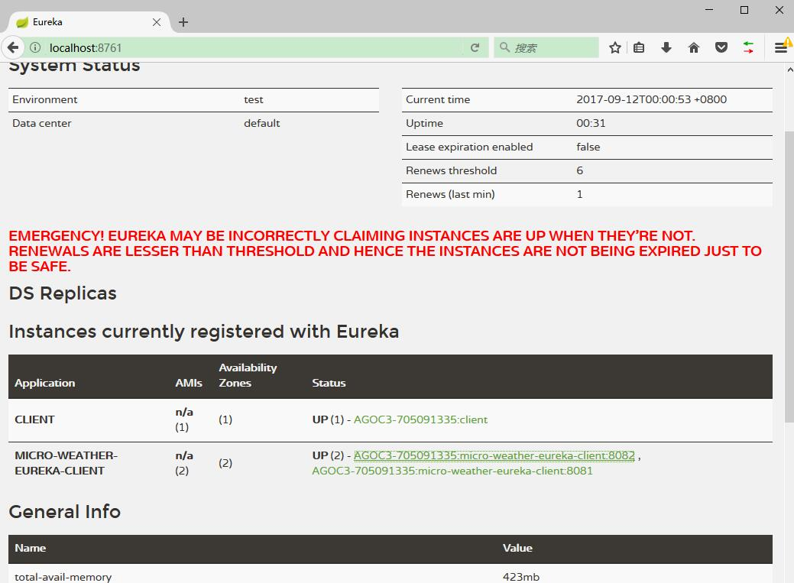

# 实现服务的注册与发现


本章节，我们将创建一个`micro-weather-eureka-client` 作为客户端，并演示如何让将自身向注册服务器进行注册，让其可以其他服务都调用。

## 开发环境

* Gradle 4.0
* Spring Boot 2.0.0.M3
* Spring Cloud Netflix Eureka Client Finchley.M2


## 更改配置

增加如下配置：

```groovy
dependencies {
    //...

	compile('org.springframework.cloud:spring-cloud-starter-netflix-eureka-client')

	//...
}
```

## 一个最简单的 Eureka Client

```java
@SpringBootApplication
@EnableDiscoveryClient
@RestController
public class Application {

    @RequestMapping("/")
    public String home() {
        return "Hello world";
    }

	public static void main(String[] args) {
		SpringApplication.run(Application.class, args);
	}
}
```

项目配置：

```
spring.application.name: micro-weather-eureka-client

eureka.client.serviceUrl.defaultZone: http://localhost:8761/eureka/
```

## 运行

分别在 8081 和 8082 上启动了客户端示例。可以在 Eureka Server 上看到这两个实体的信息。

