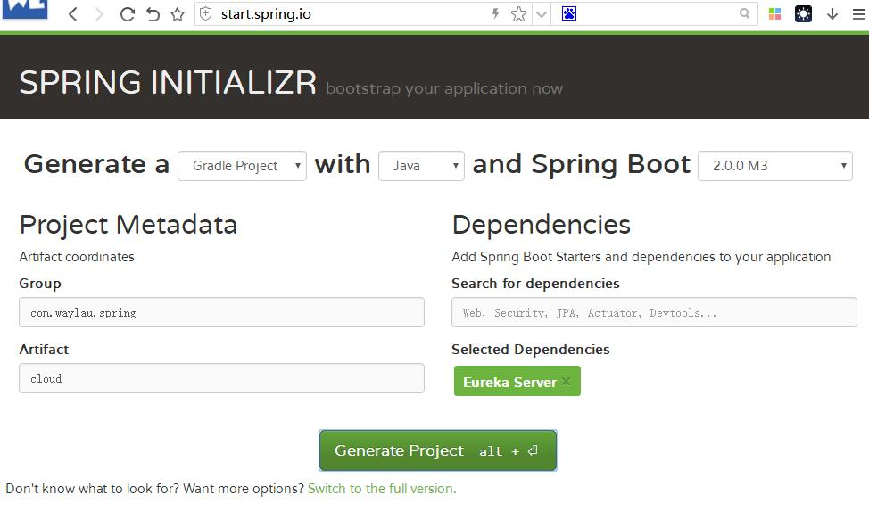
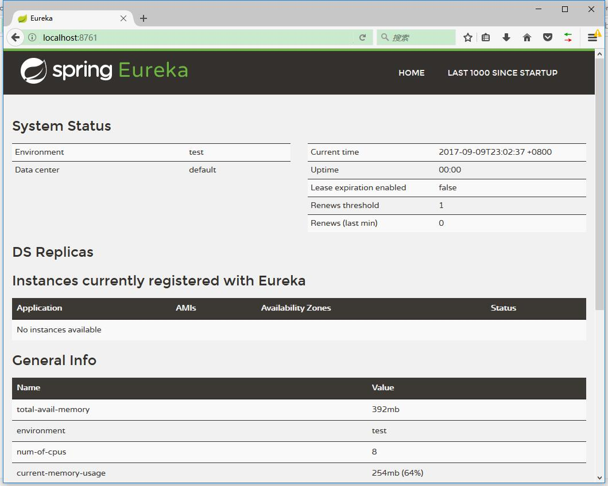

# 如何集成Eureka

本章节，我们将创建一个`micro-weather-eureka-server` 作为注册服务器。


## 开发环境

* Gradle 4.0
* Spring Boot 2.0.0.M3
* Spring Cloud Netflix Eureka Server Finchley.M2

## 从 Spring Initializr 进行项目的初始化

访问<http://start.spring.io/> 进行项目的初始化。



## 更改配置

根据下面两个博客的指引来配置，加速项目的构建。

* Gradle Wrapper 引用本地的发布包 ： <https://waylau.com/change-gradle-wrapper-distribution-url-to-local-file/>
* 使用Maven镜像 ： <https://waylau.com/use-maven-mirrors/>

## 启用 Eureka Server

为启用 Eureka Server ，在 Application 上增加`@EnableEurekaServer`注解即可。

```java
@SpringBootApplication
@EnableEurekaServer
public class Application {

	public static void main(String[] args) {
		SpringApplication.run(Application.class, args);
	}
}
```

## 修改项目配置

修改 application.properties，增加如下配置。

```
server.port: 8761

eureka.instance.hostname: localhost
eureka.client.registerWithEureka: false
eureka.client.fetchRegistry: false
eureka.client.serviceUrl.defaultZone: http://${eureka.instance.hostname}:${server.port}/eureka/
```

其中：

* server.port: 指明了应用启动的端口号
* eureka.instance.hostname: 应用的主机名称
* eureka.client.registerWithEureka: 值为`false`意味着自身仅作为服务器，不作为客户端 
* eureka.client.fetchRegistry:  值为`false`意味着无需注册自身
* eureka.client.serviceUrl.defaultZone: 指明了应用的URL

## 启动

启动应用，访问<http://localhost:8761/>，可以看到  Eureka Server 自带的 UI 管理界面。


