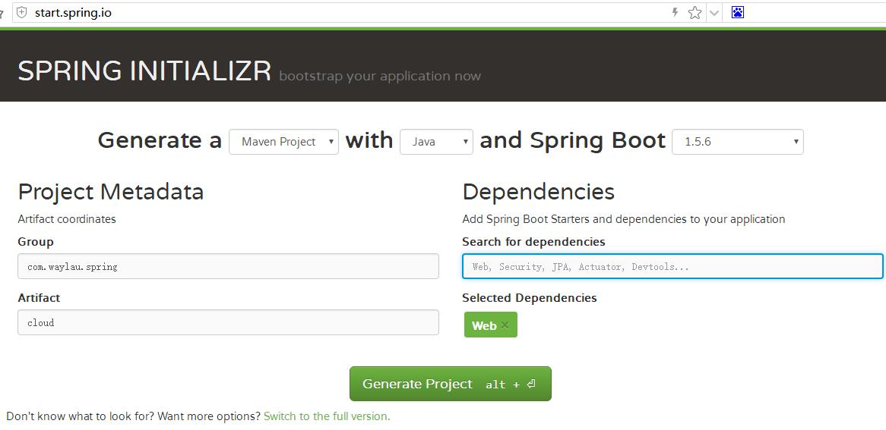

# Spring Cloud 入门配置

在项目中开始使用 Spring Cloud 的推荐方法是使用依赖关系管理系统，比如，使用 Maven 或者 Gradle 构建。


## Maven 配置

以下是一个基本的 Spring Boot 项目的基本 Maven 配置：

```
<?xml version="1.0" encoding="UTF-8"?>
<project xmlns="http://maven.apache.org/POM/4.0.0" xmlns:xsi="http://www.w3.org/2001/XMLSchema-instance"
	xsi:schemaLocation="http://maven.apache.org/POM/4.0.0 http://maven.apache.org/xsd/maven-4.0.0.xsd">
	<modelVersion>4.0.0</modelVersion>

	<groupId>com.waylau.spring</groupId>
	<artifactId>cloud</artifactId>
	<version>0.0.1-SNAPSHOT</version>
	<packaging>jar</packaging>

	<name>basic-maven</name>
	<description>Basic project for Maven</description>

	<parent>
		<groupId>org.springframework.boot</groupId>
		<artifactId>spring-boot-starter-parent</artifactId>
		<version>1.5.6.RELEASE</version>
		<relativePath/> <!-- lookup parent from repository -->
	</parent>

	<properties>
		<project.build.sourceEncoding>UTF-8</project.build.sourceEncoding>
		<project.reporting.outputEncoding>UTF-8</project.reporting.outputEncoding>
		<java.version>1.8</java.version>
	</properties>

	<dependencies>
		<dependency>
			<groupId>org.springframework.boot</groupId>
			<artifactId>spring-boot-starter-web</artifactId>
		</dependency>

		<dependency>
			<groupId>org.springframework.boot</groupId>
			<artifactId>spring-boot-starter-test</artifactId>
			<scope>test</scope>
		</dependency>
	</dependencies>

	<build>
		<plugins>
			<plugin>
				<groupId>org.springframework.boot</groupId>
				<artifactId>spring-boot-maven-plugin</artifactId>
			</plugin>
		</plugins>
	</build>


</project>
```

在此基础之上，您可以按需添加不同的依赖，以使您的应用程序增强功能。

## Gradle 配置


以下是一个基本的 Spring Boot 项目的基本 Maven 配置：

```groovy
buildscript {
	ext {
		springBootVersion = '1.5.6.RELEASE'
	}
	repositories {
		mavenCentral()
	}
	dependencies {
		classpath("org.springframework.boot:spring-boot-gradle-plugin:${springBootVersion}")
	}
}

apply plugin: 'java'
apply plugin: 'eclipse'
apply plugin: 'org.springframework.boot'

version = '0.0.1-SNAPSHOT'
sourceCompatibility = 1.8

repositories {
	mavenCentral()
}


dependencies {
	compile('org.springframework.boot:spring-boot-starter-web')
	testCompile('org.springframework.boot:spring-boot-starter-test')
}
```


在此基础之上，您可以按需添加不同的依赖，以使您的应用程序增强功能。


## 声明式方法

Spring Cloud 采用声明的方法，通常只需要一个类路径更改和/或注释即可获得很多功能。下面是 Spring Boot 最简单的应用程序示例：


```java
@SpringBootApplication
public class Application {

	public static void main(String[] args) {
		SpringApplication.run(Application.class, args);
	}
}
```

## 自动生成项目

Spring 官方提供了基于 Web 的 Spring Initializr 项目，用于 Spring 项目的快速生成。作为项目的初始化，采用 Spring Initializr  是个不错的选择。访问 <http://start.spring.io> ，填入相关的项目信息，选择合适的依赖，即可实现项目源码的下载。而这个过程，你无需关心你的依赖是如何来管理的， Spring Initializr 为你准备好了一切。



## 源码

本章节源码，见`basic-maven` 和 `basic-gradle`。